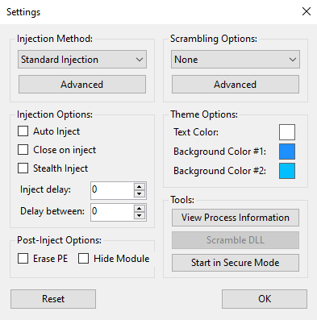
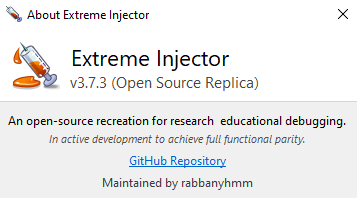

# Extreme Injector v3 (Open Source)

<p align="center">
  <a href="https://dotnet.microsoft.com/"></a>
  <a href="https://microsoft.com/windows"></a>
  <a href="LICENSE"></a>
</p>

A 1:1 open-source C# replica of **Extreme Injector v3 by master131**, built for .NET Framework 4.8 using Windows Forms and low-level Win32 / NT native APIs. It recreates the original user interface, custom controls, dialogs, injection modes, and stealth options pixel for pixel.

---

## Screenshots

<p align="center">
  &nbsp;
  &nbsp;
  
</p>

---

## Features

### Injection Methods
- **Standard Injection:** Uses `CreateRemoteThread` or `NtCreateThreadEx` with `LoadLibraryW`.
- **LdrLoadDll / LdrpLoadDll Stub:** Executes a position-independent stub to call `ntdll!LdrLoadDll`.
- **Manual Mapping:** Parses and maps PE headers in memory, fixes relocations, resolves IAT imports, executes TLS callbacks, and registers x64 SEH tables (`RtlAddFunctionTable`).
- **Thread Context Hijacking:** Suspends an existing target thread, saves context (GPRs, Flags, XMM registers), redirects `RIP`/`EIP` to a trampoline stub, calls `LoadLibraryW`, and resumes execution.

### Anti-Detection & Hardening
- **Handle Hijacking:** Scans system handle tables via `NtQuerySystemInformation` and duplicates existing process handles to bypass `OpenProcess` hooks on protected processes (e.g., HD-Player / emulators).
- **Stealth Inject:** Spawns threads with `THREAD_CREATE_FLAGS_SKIP_THREAD_ATTACH` via `NtCreateThreadEx`.
- **Erase PE Header:** Wipes the first 4KB PE header (`IMAGE_DOS_HEADER` & `IMAGE_NT_HEADERS`) in remote memory.
- **Hide Module:** Unlinks injected modules from `PEB_LDR_DATA` chains (`InLoadOrder`, `InMemoryOrder`, `InInitializationOrder`).
- **Hide From Debugger:** Masks threads using `NtSetInformationThread(ThreadHideFromDebugger)`.
- **DLL Scrambler:** 13 PE obfuscation options including header randomization, section renaming, debug data stripping, and import descriptor shuffling.

### Tools & UI
- **Crosshair Target Picker:** Drag the crosshair icon over any window to automatically select its process.
- **Auto Inject:** Automatically injects DLLs when the target process launches.
- **Process Information:** Inspect memory regions, thread IDs, loaded modules, and PE export functions.
- **Custom Themes:** Customizable GDI+ gradient background and text styling saved to `settings.xml`.

---

## Technical Overview

| Method / Feature | Mechanism / NTAPI | Description |
|---|---|---|
| **Standard** | `CreateRemoteThread` / `LoadLibraryW` | Standard remote thread injection |
| **LdrLoadDll** | `ntdll!LdrLoadDll` | Native loader call with NTSTATUS decoding |
| **Manual Map** | In-Memory PE Loader | Maps PE sections and fixes IAT/relocations in user mode |
| **Thread Hijack** | `GetThreadContext` / `SetThreadContext` | Borrows existing thread pointer (`RIP`/`EIP`) |
| **Handle Hijack** | `NtQuerySystemInformation` + `DuplicateHandle` | Bypasses `OpenProcess` anti-cheat hooks |
| **Stealth Inject** | `NtCreateThreadEx` | Suppresses `DLL_THREAD_ATTACH` notifications |
| **Erase PE Header** | `VirtualProtectEx` + zero-fill | Wipes 4KB PE headers in target memory |
| **Hide Module** | PEB LDR Unlinking | Removes module entry from PEB lists |
| **PE Scrambler** | PE Mutations | 13 binary header and section obfuscation passes |

---

## Project Structure

```text
Extreme-Injector-Open-Source/
├── assets/
│   ├── ExtremeInjector.png               # Main UI screenshot
│   ├── settings.png                      # Settings dialog screenshot
│   └── about.png                         # About dialog screenshot
├── src/
│   └── ExtremeInjectorReplica/
│       ├── Config/
│       │   └── Settings.cs               # Settings configuration & XML serialization
│       ├── Core/
│       │   ├── NativeMethods.cs          # P/Invoke declarations & structs
│       │   ├── PrivilegeManager.cs       # Token privilege adjustments (SeDebugPrivilege)
│       │   ├── HandleHijacker.cs         # Handle table scanner & duplication fallback
│       │   ├── RemoteExportResolver.cs   # WoW64 / 64-bit export resolution
│       │   ├── PeParser.cs               # In-memory PE header parser
│       │   ├── StandardInjector.cs       # Standard injection engine
│       │   ├── LdrLoadDllInjector.cs     # LdrLoadDll stub engine
│       │   ├── ManualMapInjector.cs      # Manual map PE loader
│       │   ├── ThreadHijackInjector.cs   # Thread context hijacking engine
│       │   ├── ScramblerEngine.cs        # PE scrambler & mutation engine
│       │   ├── PostProcessor.cs          # Header erasing & PEB unlinking
│       │   └── InjectionOrchestrator.cs  # Injection dispatcher
│       └── UI/
│           ├── MainForm.cs               # Main application form
│           ├── ProcessSelectForm.cs      # Process selection dialog
│           ├── WindowPickerForm.cs       # Drag-and-drop window picker
│           ├── SettingsForm.cs           # Settings dialog
│           ├── ProcessInformationForm.cs # Process & module diagnostic viewer
│           └── ThemeManager.cs           # Custom GDI+ styling & themes
├── LICENSE
└── README.md
```

---

## Building from Source

### Prerequisites
* Windows 10 or Windows 11 (x86 / x64)
* [.NET Framework 4.8 Developer Pack](https://dotnet.microsoft.com/download/dotnet-framework/net48) or Visual Studio 2019 / 2022

### Build

```powershell
# Clone the repository
git clone https://github.com/rabbanyhmm/Extreme-Injector-Open-Source.git
cd Extreme-Injector-Open-Source

# Build Release binary
dotnet build ./src/ExtremeInjectorReplica/ExtremeInjectorReplica.csproj -c Release
```

The output executable will be created at `src/ExtremeInjectorReplica/bin/Release/net48/Extreme Injector v3.exe`.

---

<h2 align="center">Contributors</h2>

<p align="center">
  <a href="https://github.com/rabbanyhmm/Extreme-Injector-Open-Source/graphs/contributors">
    
  </a>
</p>

<h3 align="center">Credits & Acknowledgements</h3>

<p align="center">
  <a href="https://github.com/master131">
    
  </a>
  &nbsp;&nbsp;
  <a href="https://github.com/ShlokBorad">
    
  </a>
</p>

---

## License & Disclaimer

This project is licensed under the [MIT License](LICENSE).

> **Educational & Research Purpose:** This tool is developed strictly for educational research, software reverse engineering, and system internals exploration. Extreme Injector v3 was originally created by **[master131](https://github.com/master131/extremeinjector)**. All trademarks, original visual designs, and UI layouts belong to their respective authors.
