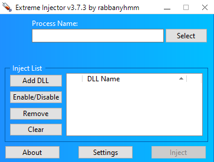

# Extreme Injector (Open Source)

[](https://github.com/rabbanyhmm/Extreme-Injector-Open-Source)
[](https://dotnet.microsoft.com/)
[-0078D6?logo=windows)](https://microsoft.com/windows)
[](LICENSE)

An open-source recreation of **Extreme Injector v3**, developed in C# on **.NET Framework 4.8 (Windows Forms)** using native Win32/NT APIs.

<p align="center">
  
</p>

> **Note**: This project is an ongoing, community-driven effort aiming to achieve full functional and visual parity with the original software. It is not an official source release.

---

## Capabilities & Roadmap

| Category | Features / Functions | Status |
| :--- | :--- | :---: |
| **Process Selector** | • Enumerate active processes and visible application windows<br>• Real-time PID, title, and executable description detection<br>• Dynamic high-res icon extraction from target executables | ✅ Implemented |
| **Module Management** | • Multi-DLL batch queue with checkbox toggling<br>• Drag-and-drop file import and load order sorting<br>• Open containing folder and module removal shortcuts | ✅ Implemented |
| **Module Configuration** | • 32-bit & 64-bit PE export table parsing<br>• Export function entry point execution on inject<br>• Calling convention selection (`__stdcall`, `__cdecl`, `__fastcall`) | ✅ Implemented |
| **Injection Engine** | • Standard Injection (`CreateRemoteThread` + `LoadLibraryW`)<br>• Manual Mapping (PE section allocation, relocation fixups, import resolution, TLS)<br>• Thread Hijacking (`SuspendThread` / `SetThreadContext`)<br>• Undocumented NT API execution (`LdrLoadDll` / APC) | 🔄 In Progress |
| **Cloaking & Scrambling**| • PE Header Erase / Nulling<br>• Module Cloaking & Unlink from PEB<br>• Automatic uninject on target process termination | 🔄 In Progress |

---

## Project Structure

```text
Extreme-Injector-Open-Source/
├── src/
│   └── ExtremeInjectorReplica/
│       ├── Core/
│       │   ├── NativeMethods.cs      # Win32, NTDLL, and Kernel32 P/Invoke definitions
│       │   └── PeParser.cs           # PE32 / PE32+ Export directory parser
│       ├── Config/
│       │   └── SettingsManager.cs    # Local state and XML/JSON configuration persistence
│       ├── UI/
│       │   ├── MainForm.cs           # Primary interface & event routing
│       │   ├── ProcessSelectForm.cs  # Process & Window selector dialog
│       │   ├── DllItemConfigForm.cs  # Advanced module & export invocation options
│       │   ├── AboutForm.cs          # Application details & repository links
│       │   └── ThemeManager.cs       # Custom GDI+ control rendering & styles
│       ├── ExtremeInjector.ico
│       └── ExtremeInjectorReplica.csproj
├── .gitignore
├── LICENSE
└── README.md
```

---

## Building from Source

### Prerequisites
- Windows 10 / 11 (64-bit)
- [.NET 9.0 SDK](https://dotnet.microsoft.com/download/dotnet/9.0)

### Build & Run
```bash
# Clone the repository
git clone https://github.com/rabbanyhmm/Extreme-Injector-Open-Source.git
cd Extreme-Injector-Open-Source

# Build the project
dotnet build ./src/ExtremeInjectorReplica/ExtremeInjectorReplica.csproj -c Release

# Run the application
dotnet run --project ./src/ExtremeInjectorReplica/ExtremeInjectorReplica.csproj
```

---

## Contributing

Contributions are welcome as we work toward complete parity with the original software:

1. **Fork** the repository
2. **Create a branch** (`git checkout -b feature/your-feature`)
3. **Commit changes** (`git commit -m 'Add your feature'`)
4. **Push to branch** (`git push origin feature/your-feature`)
5. **Open a Pull Request**

---

## License

This project is licensed under the [MIT License](LICENSE). For educational and research purposes only.
